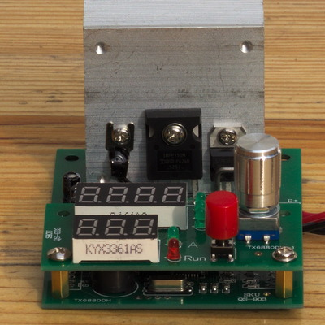
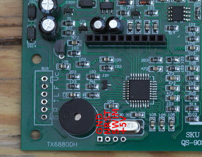

# Electronic Load
Reinvented firmware for the electronic load 60W. Status: **beta**.

The load can be ordered from Chine (AliExpress, eBay etc), something like this one:

I would recommend to not program the chip in the device, because:
* then you can return to original firmware if you don't like this one
* it's STM8S**0**05K6T6C, that means you can one program it about 100 times

Take rather a new STM8S**1**05K4T6C or STM8S**1**05K6T6C and solder it.

Programmer connection:

[Analog part schematic](http://www.voltlog.com/pub/dummy-load-sch.pdf) (one correction: PB3 is connected to +12V via 20k).

Calibration values in the code are for my instance, may be you have to adjust them for your one.

